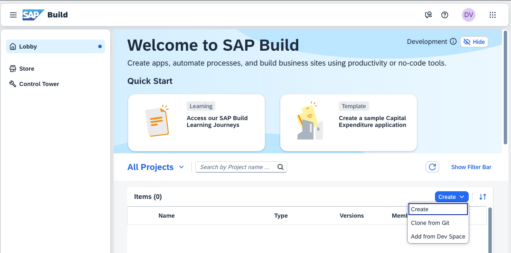
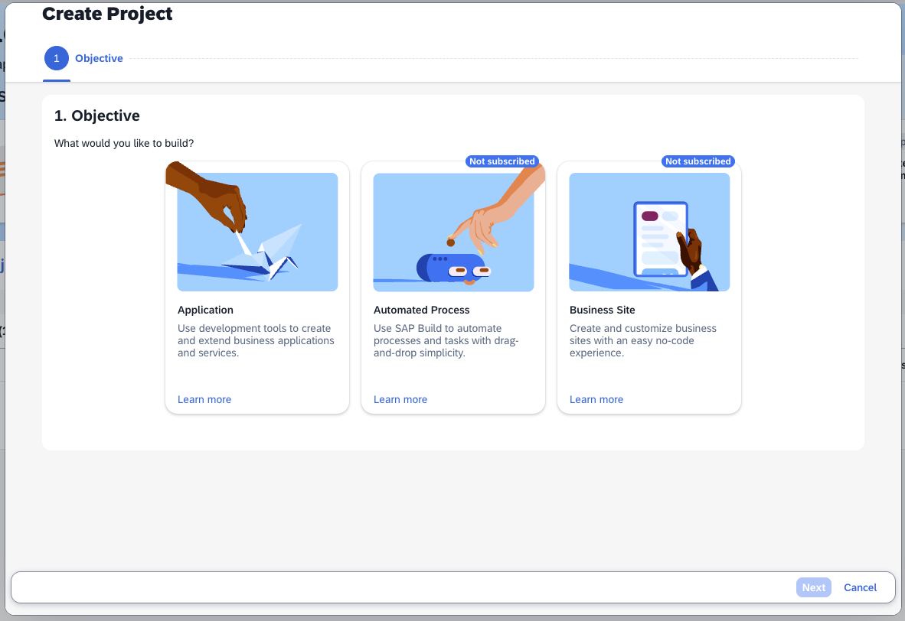
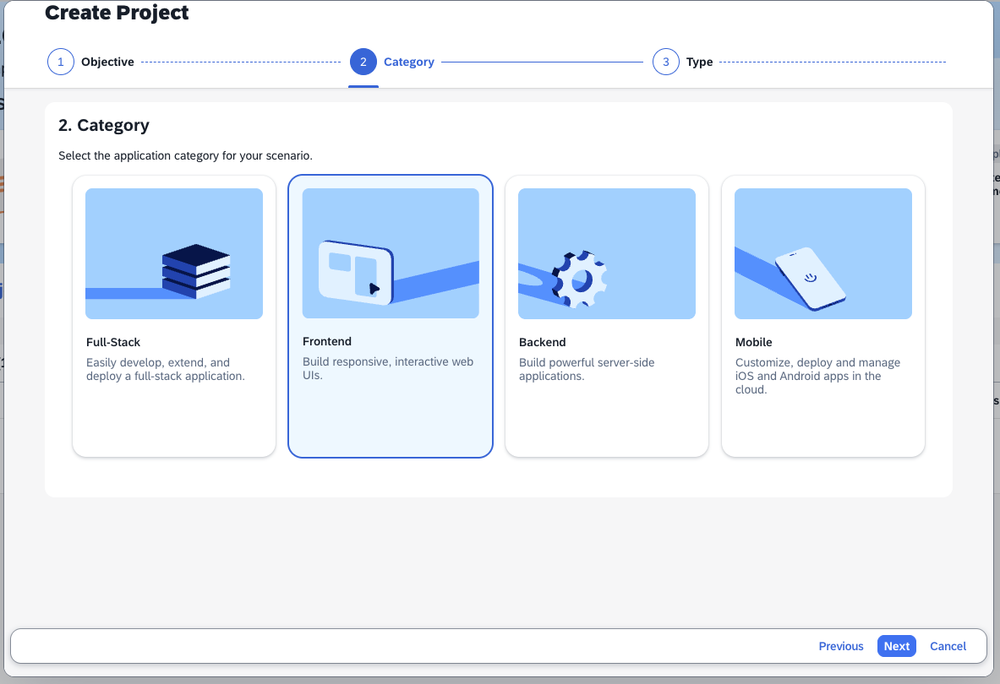
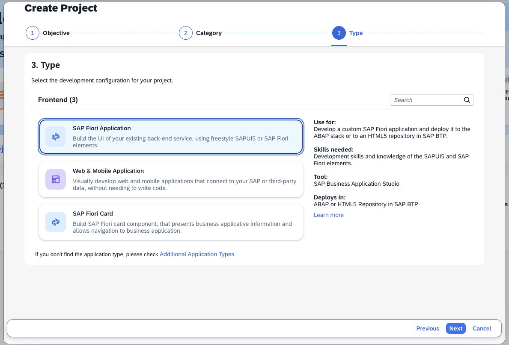
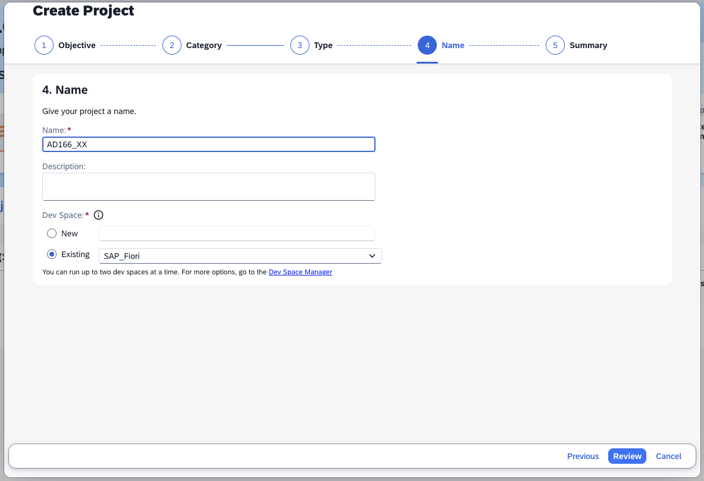
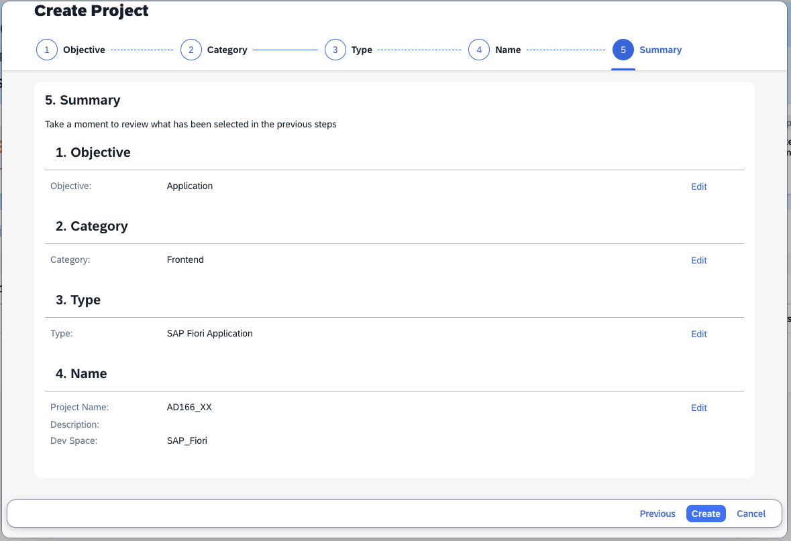
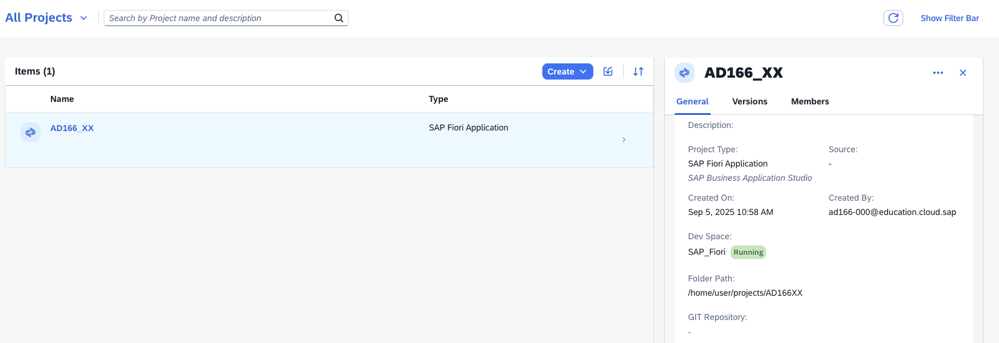
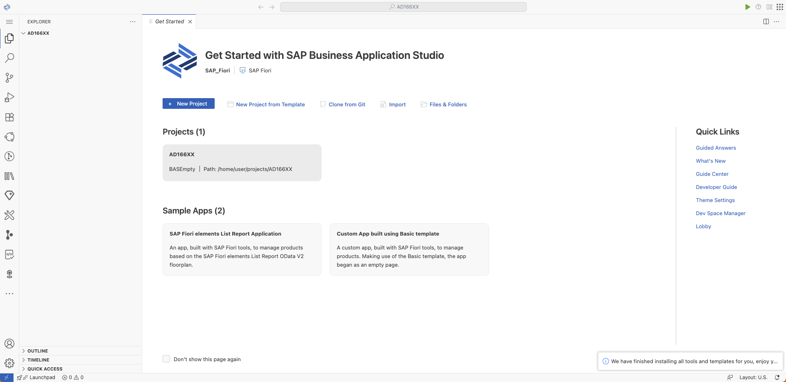

# Getting Started

## Background & Context
> 📖 **What you'll learn**: In this exercise, you will be guided on how to access your SAP Business Application Studio account, set up a development space, and gain a quick introduction to its functionalities.

## Learning Objectives
> 🎯 **After completing these steps** you will know how to:
> - Open SAP Business Application Studio
> - Prepare it for development
> - Navigate the basic interface

## Exercise Steps

### Logon

📋 **Action Required**: Follow these steps to access your development environment.

1. **Open the SAP Build Lobby**
   
   Navigate to the [SAP Build Lobby](https://ad166-bis8vgc5.eu10.build.cloud.sap/lobby) using a web browser of your choice (Google Chrome, Microsoft Edge, Apple Safari, etc.) and log in using your credentials.

2. **Create a new project**
   
   Press the "Create" button above the table and select the "Create" option.
     

3. **Select Application type**
   
   Select "Application" and press the "Next" button.
     

4. **Choose Frontend option**
   
   Select "Frontend" and press the "Next" button.
     

5. **Select SAP Fiori Application**
   
   Next select "SAP Fiori Application" and go to the next step.
     

6. **Configure your project**
   
   Assign a name to your project, e.g. *AD166_XX*, where *XX* is your user number. Leave the default dev space and press on the "Review" button to reach the summary. On there, press "Create" to finish the setup.
     
     

7. **Wait for environment setup**
   
   Your project alongside the dev space is being prepared and starts up. This might take a few minutes. Wait until the status shows *RUNNING*.
     

8. **Access your project**
   
   Click on your project name, e.g. *AD166_XX*, this will open your newly created project space inside of SAP Business Application Studio.
     

9. **Bookmark for future access**
   
   > 💡 **Tip**: Bookmark this URL, so it'll be easier for you to access your dev space within SAP Business Application Studio.

## Summary

> ✅ **Congratulations!** You have successfully completed the [Getting Started](#getting-started) exercise!
> 
> **What you accomplished**:
> - ✓ Accessed SAP Business Application Studio
> - ✓ Created a new development project
> - ✓ Set up your development environment
> - ✓ Learned basic navigation

---

**📚 Next Steps**: Continue to [Exercise 1 - Project Setup Using Easy-UI5](../ex1/README.md).
