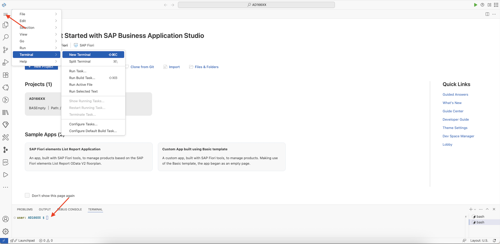
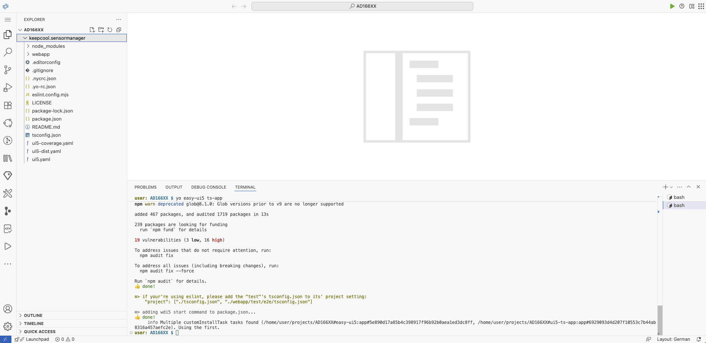
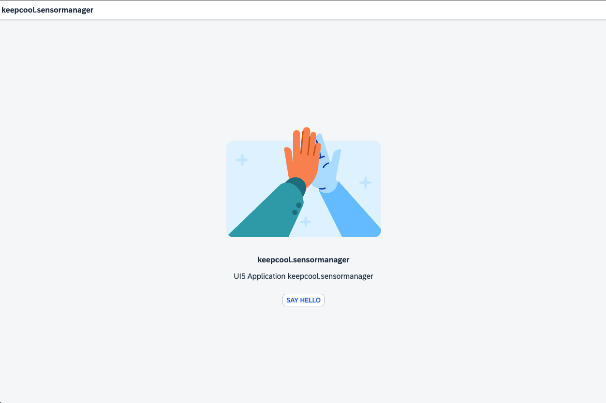

[](keepcool.sensormanager)

# Exercise 1 - Project Setup Using Easy-UI5

## Background & Context
> 📖 **What you'll learn**: In this exercise you'll create a new UI5 application using [Yeoman](https://yeoman.io/) and [Easy-UI5](https://github.com/SAP/generator-easy-ui5/).

## Scenario
> 🏢 **Business Context**: Your customer "Keep Cool, Inc." is an operator of several icehouses across the country. Recently, they have been upgraded with new sensors with Internet connection, so that their measuring values are available as a service. To make use of this data and improve their internal workflows, the company asked us to provide an application leveraging this sensor data, visualize it, and provide an overview of the current state of each sensor, so that they can react quickly on any issues.

## Learning Objectives
> 🎯 **After completing these steps** you will have:
> - Created your first UI5 application using modern tooling
> - Learned to use Yeoman and Easy-UI5 generator
> - Set up a TypeScript-based UI5 project
> - Previewed your generated application

## Exercise Steps

### Exercise 1.1 - Create a New UI5 Application

📋 **Action Required**: Follow these steps to create your UI5 application.

1. **Open the terminal**
   
   Open the terminal by clicking on the icon in the upper left corner.
   <br><br><br><br>

2. **Install required tools**
   
   Install [Yeoman](https://yeoman.io/) and the [Easy-UI5 generator](https://github.com/SAP/generator-easy-ui5/) via NPM by running the following command in the terminal:
   ```
   npm i -g yo generator-easy-ui5
   ```

3. **Generate the UI5 application**
   
   Use *Easy-UI5* to generate a new UI5 application using TypeScript with the following command in the terminal:
   ```
   yo easy-ui5 ts-app
   ```

4. **Configure application settings**
   
   The generator will ask you to provide several settings, enter the following settings in the terminal (you can use the suggested value by pressing *ENTER*):
   ```
   ? Enter your application id (namespace)? keepcool.sensormanager
   ? Which framework do you want to use? SAPUI5
   ? Which framework version do you want to use? 1.140.0
   ? Who is the author of the application? <your name>
   ? Would you like to create a new directory for the application? Yes
   ? Would you like to initialize a local git repository for the application? No
   ```

5. **Verify project creation**
   
   > ✅ **Expected Result**: *Easy-UI5* will generate a UI5 TypeScript application, which will incorporate the latest best-practices. Once installation and generation is done, you should see a new folder *keepcool.sensormanager* containing your project files.
   <br><br><br><br>

### Exercise 1.2 - Try out the generated Application

📋 **Action Required**: It's time for a first preview of your newly created application!

> ⚠️ **Important**: Before previewing your application, make sure to change the directory in the terminal to your newly created project:

```
cd keepcool.sensormanager
```

**Start the application**

You can preview the application by executing the following command in the terminal:
```
npm run start
```

> ✅ **Expected Result**: After a few moments, the application should start up as following:
<br><br><br><br>

## Summary

> ✅ **Congratulations!** You've successfully accomplished [Exercise 1 - Project Setup Using Easy-UI5](#exercise-1---project-setup-using-easy-ui5)!
> 
> **What you accomplished**:
> - ✓ Set up Yeoman and Easy-UI5 generator
> - ✓ Created a new TypeScript-based UI5 application
> - ✓ Configured your project settings
> - ✓ Successfully previewed your application

---

**📚 Next Steps**: Continue to [Exercise 2 - Basic UI5 Configuration and View Creation](../ex2/README.md).
