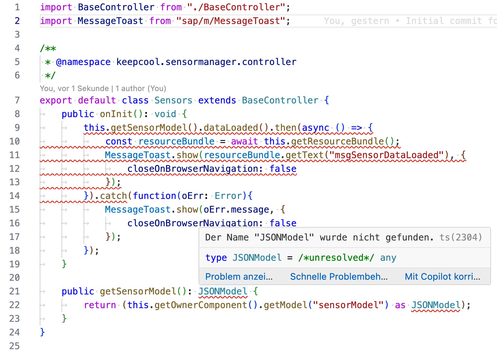

[](keepcool.sensormanager)

# Exercise 4 - Improve Visualization

## Background & Context
> 📖 **What you'll learn**: You achieved a lot in the previous exercises. Now it's time to dress up your UI5 application with some visual effects!

## Learning Objectives
> 🎯 **After completing these steps** you will have:
> - Replaced hard-coded text with i18n variables for localization
> - Enhanced the sensor view with better visualization
> - Implemented controller logic for status handling
> - Created custom formatters for data display
> - Applied professional styling to your sensor cards

## Exercise Steps


### Exercise 4.0 - Replacing Hard-Coded Text With i18n Variables

📋 **Action Required**: Implement proper internationalization (i18n) for your application.

> 📖 **Context**: In your existing UI5 application you've used hard-coded text values. That's OK if you'd like to implement a fast proof of concept. In your productive application no hard-coded text should be used, however, because it would be displayed regardless of the actual browser language the user has configured. Your goal is to build an enterprise-ready application which is fully localized. UI5 comes with a huge set of localization features out of the box, one of which is automatic language selection and text localization.

> ⚠️ **Best Practice**: It's good practice to start directly with localization in mind instead of refactoring many places in your application afterwards.

**Update i18n.properties**

Replace the content within the `keepcool.sensormanager/webapp/i18n/i18n.properties` with the following values:

````ini
title=Keep Cool Inc. Sensor Manager
appTitle=Sensor Manager
appDescription=The sensor manager
noSensorDataText=No Sensor Data
distanceLabel=Distance
distanceUnit=km
msgSensorDataLoaded=All sensors online!
msgFilterAll=All
msgFilterCold=Cold
msgFilterWarm=Warm
msgFilterHot=Too Hot
toolTipSelectCustomer=Select Customer
titleSelectCustomer=Select Customers
titleSensorStatus=Sensor Status
cardTitle=Customer: {0}
locationLabel=Location
cardSubTitle={0}: {1}, {2}: {3}{4}
temperatureUnit=°C
````

> 💡 **Note**: These are the texts which are going to be used throughout the following exercises.

**Update English localization**

Let's do the same for the `i18n_en.properties`, which is the text localization file used for the english locale.

**Update German localization**

Alongside `i18n.properties` and `i18n_en.properties`, Easy-UI5 generated a german localization file for you as well.

Populate the file `keepcool.sensormanager/webapp/i18n/i18n_de.properties` with the following values:

```ini
title=Keep Cool Inc. Sensor Manager
appTitle=Sensor Manager
appDescription=Der Sensormanager
noSensorDataText=Keine Sensordaten
distanceLabel=Entfernung
distanceUnit=km
msgSensorDataLoaded=Alle Sensoren aktiv!
msgFilterAll=Alle
msgFilterCold=Kalt
msgFilterWarm=Warm
msgFilterHot=Zu Heiß
toolTipSelectCustomer=Wähle Kunden
titleSelectCustomer=Kundenauswahl
titleSensorStatus=Sensor Status
cardTitle=Kunde: {0}
locationLabel=Ort
cardSubTitle={0}: {1}, {2}: {3}{4}
temperatureUnit=°C
```

### Exercise 4.1 - Enhance Sensors.view.xml

📋 **Action Required**: Add visual enhancements to your sensor display.

> 📖 **Context**: To give the customer the best possible overview, add some color to your application. Introduce a new layout and structure for the items, and also show an `sap.ui.core.Icon` there.

1. **Add required namespace**
   
   Open `Sensors.view.xml` and add the xml namespace `xmlns:core="sap.ui.core"` to the view to have the `sap.ui.core.Icon` available.

	***keepcool.sensormanager/webapp/view/Sensors.view.xml***

	````xml
	<mvc:View
		controllerName="keepcool.sensormanager.controller.Sensors"
		xmlns:core="sap.ui.core"
		xmlns:mvc="sap.ui.core.mvc"
		xmlns="sap.m"
		xmlns:grid="sap.ui.layout.cssgrid"
		xmlns:f="sap.f"
		displayBlock="true">
	````

2. **Add temperature icon and layout**
   
   Add a temperature icon as well as layouting to the `sap.m.CustomListItem` control. `sapUiSmallMarginTop` and `sapUiSmallMarginEnd` are predefined responsive css classes, which add screen size dependent spacing to controls. `sap.m.HBox`and `sap.m.VBox` are helpers for layouting your application.

	***keepcool.sensormanager/webapp/view/Sensors.view.xml***

	````xml
								<CustomListItem  type="Active">
									<layoutData>
										<FlexItemData
											growFactor="1"
											shrinkFactor="0"/>
									</layoutData>
									<HBox justifyContent="SpaceBetween">
										<VBox
											justifyContent="SpaceBetween"
											class="sapUiSmallMarginTop sapUiSmallMarginBegin">
											<Title text="{sensorModel>location}"/>
											<Label text="{i18n>distanceLabel}:"/>
										</VBox>
										<core:Icon
											src="sap-icon://temperature"
											size="2.5rem"
											class="sapUiSmallMarginTop sapUiSmallMarginEnd"/>
									</HBox>
									<HBox
										justifyContent="SpaceBetween"
										class="sapUiTinyMarginTop sapUiSmallMarginBottom sapUiSmallMarginBeginEnd">
										<ObjectNumber
											number="{sensorModel>distance}"
											unit="{i18n>distanceUnit}"/>
									</HBox>
								</CustomListItem>
	````

**Test the visual changes**

Let's take a look at the application and the changes in the item layout of the `GridList` control:
<br><br><br><br>

> � **Learn More**: [Icons in the Horizon visual theme](https://www.sap.com/design-system/fiori-design-web/foundations/visual/iconography/iconography-horizon).

### Exercise 4.2 - Enhance Sensors.controller.ts

📋 **Action Required**: Add controller logic for enhanced functionality.

> 📖 **Context**: In this exercise you'll enhance your application with some additional controller coding by extending your existing `Sensors.controller.ts` controller.

1. **Update imports**
   
   Replace the `MessageBox` import with an import of the `sap.m.MessageToast`.

	```ts
	import MessageToast from "sap/m/MessageToast";
	```

2. **Add initialization logic**
   
   Your goal is to show an `sap.m.MessageToast` when your sensor data is loaded. Replace the `sayHello` function of `Sensors.controller.ts` with the following content. This also adds a function `getSensorModel` to retrieve the sensor model.
   
   > 💡 **IDE Tip**: Depending on the used code editor, you can also navigate to the definition of the respective UI5 API. E.g. in Visual Studio Code by holding the Ctrl key while clicking the name. This does not lead to the original source code of UI5, which is written in JavaScript, but to the TypeScript type definition files of UI5. Nevertheless it can be very helpful to browse through the methods offered by a class or to navigate further up the inheritance chain.

	***keepcool.sensormanager/webapp/controller/Sensors.controller.ts***

	```ts
		public onInit(): void {
			this.getSensorModel().dataLoaded().then(async () => {
				const resourceBundle = await this.getResourceBundle();
				MessageToast.show(resourceBundle.getText("msgSensorDataLoaded"), {
					closeOnBrowserNavigation: false
				});
			}).catch(function(oErr: Error){
				MessageToast.show(oErr.message, {
					closeOnBrowserNavigation: false
				});
			});
		}

		public getSensorModel(): JSONModel {
			return (this.getOwnerComponent().getModel("sensorModel") as JSONModel);
		}
	```

**Handle missing imports**

Note that some of the modules are underlined in red. If you hover over the affected code, you can just implement the quickfix as suggested by BAS:
<br><br><br><br>
Just click on *Quick Fix* and select *Add all missing imports*. All required dependencies have now been added to the controller.

> � **Design Guidelines**: Wonder when to use a Message Toast? Find out more in the [SAP Design System Guidelines for the Message Toast](https://www.sap.com/design-system/fiori-design-web/ui-elements/message-toast/).

### Exercise 4.4 - Create your First Formatter

📋 **Action Required**: Implement custom formatting for visual data presentation.

> 📖 **Context**: Your next goal is to bring some color to the user interface. You'd like to display the icon in a suitable color which is based on the actual temperature of the sensor. To do this, you can use the formatter concept of UI5.

1. **Open the formatter file**
   
   Open `keepcool.sensormanager/webapp/model/formatter.ts`.

2. **Replace the formatter function**
   
   Replace the `formatValue` function with the `formatIconColor`.

	***keepcool.sensormanager/webapp/model/formatter.ts***

	````ts
	import { IconColor } from "sap/ui/core/library";

	enum Threshold {
		Warm = 4,
		Hot = 5
	}

	export default {
		formatIconColor(temperature: Threshold): IconColor|string {
			if (temperature < Threshold.Warm) {
				return "#0984e3";
			} else if (temperature >= Threshold.Warm && temperature < Threshold.Hot) {
				return IconColor.Critical;
			} else {
				return IconColor.Negative;
			}
		}
	};
	````

> 💡 **TypeScript Benefits**: You can observe that TypeScript allows to specify the type of the *temperature* parameter. In addition TypeScript allows us to specify a type definition for the function. In this case the *IconColor* as return type. Another advantage of TypeScript are enums. The threshold enum can be used to specify certain types of temperature status for the sensor in this example.

### Exercise 4.5 - Add the Formatter in your View

📋 **Action Required**: Connect the formatter to your view for dynamic color display.

> 📖 **Context**: You're almost done. The last piece is adding the newly created formatter function to the binding of your icon.

1. **Open the Sensors view**
   
   Open `keepcool.sensormanager/webapp/view/Sensors.view.xml`.

2. **Add formatter binding**
   
   Add the `color` property to the `sap.ui.core.Icon` definition, require the formatter module, bind the `color` property to the path `sensors>temperature/value`, and assign the formatter function to the binding.

	***keepcool.sensormanager/webapp/view/Sensors.view.xml***

	````xml
										<core:Icon
											core:require="{
												Formatter: 'keepcool/sensormanager/model/formatter'
											}"
											src="sap-icon://temperature"
											color="{path: 'sensorModel>temperature', formatter:'Formatter.formatIconColor'}"
											size="2.5rem"
											class="sapUiSmallMarginTop sapUiSmallMarginEnd"/>
	````

3. **Test the dynamic coloring**
   
   Let's see if your UI5 application can now color icons depending on the sensor data! Switch to the browser tab with the opened application preview and reload the page. The sensor icons should be displayed either in blue (okay), yellow (critical) or red (negative).
   
   > ✅ **Expected Result**:
   <br><br><br><br>

## Summary

> ✅ **Congratulations!** You completed the [Exercise 4 - Improve Visualization](#exercise-4---improve-visualization) exercise!
> 
> **What you accomplished**:
> - ✓ Implemented proper internationalization with i18n variables
> - ✓ Enhanced the sensor view with professional styling
> - ✓ Added controller logic for sensor status handling
> - ✓ Created custom formatters for data presentation
> - ✓ Improved the overall visual appeal of your application

---

**📚 Next Steps**: Continue to [Exercise 5 - Filtering with the IconTabBar](../ex5/README.md).

## Further Information

> 📚 **Additional Resources**:
> * [Model View Controller Concept](https://ui5.sap.com/#/topic/91f233476f4d1014b6dd926db0e91070)
> * [Controller](https://ui5.sap.com/#/topic/121b8e6337d147af9819129e428f1f75)
> * [Formatting, Parsing, and Validating Data](https://ui5.sap.com/#/topic/07e4b920f5734fd78fdaa236f26236d8)
