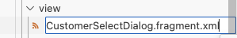
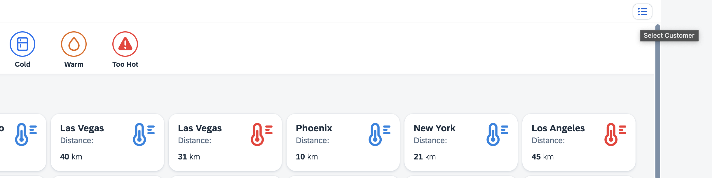
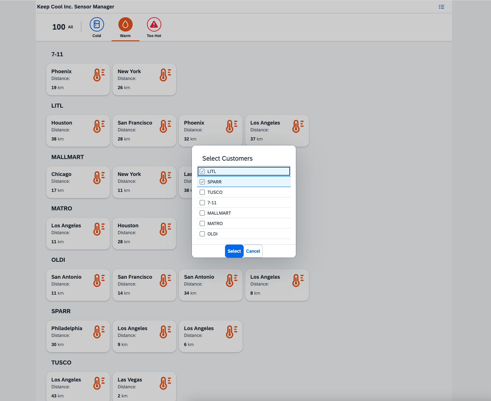

[](keepcool.sensormanager)

# Exercise 6 - Add a Dialog using UI5 Web Components

## Background & Context
> 📖 **What you'll learn**: In this exercise, you will implement a dialog that enables users to select their preferred Icehouse clients using UI5 Web Components. Web Components integrate seamlessly into SAPUI5. A UI5 Web Component with its Custom Elements metadata can be included and used like any standard SAPUI5 control.

## Learning Objectives
> 🎯 **After completing these steps** you will have:
> - Configured your project to use UI5 Web Components
> - Installed and set up the necessary tooling extensions
> - Created a customer selection dialog
> - Implemented Web Components integration with UI5

## Exercise Steps

### Exercise 6.1 - Prepare your Project

📋 **Action Required**: Configure your project for UI5 Web Components.

> 📖 **Context**: Before using external Web Components packages in your application, start by preparing your project. Add the `ui5-tooling-modules` UI5 Tooling extension and configure your `ui5.yaml` file. The `ui5-tooling-modules` extension allows for handling npm dependencies, including the UI5 Web Components.

**Install the required extension**

Run the following command in the terminal to add the `ui5-tooling-modules` extension to your project:

```bash
npm install ui5-tooling-modules --save-dev -rte
```

> 💡 **Expected Result**: This adds the extension to your project's `package.json` under `devDependencies`, similar to the example below:

```json
{
	"devDependencies": {
		"ui5-tooling-modules": "^3"
	}
}
```

By providing the `-rte` flag to the command, you enable the automatic registration of the custom task and custom middleware to your `ui5.yaml` file.

```yaml
builder:
  customTasks:
    - name: ui5-tooling-modules-task
      afterTask: ui5-tooling-transpile-task

server:
  customMiddleware:
    - name: ui5-tooling-modules-middleware
      afterMiddleware: ui5-tooling-transpile-middleware
```

To enable TypeScript support for UI5 Web Components during development, you need to add the following configuration to `ui5-tooling-modules-task` and `ui5-tooling-modules-middleware`. Your `ui5.yaml` file should look like this:

```yaml
builder:
  customTasks:
    - name: ui5-tooling-modules-task
      afterTask: ui5-tooling-transpile-task
      configuration:
        pluginOptions:
          webcomponents:
            skipDtsGeneration: false
server:
  customMiddleware:
    - name: ui5-tooling-modules-middleware
      afterMiddleware: ui5-tooling-transpile-middleware
      configuration:
        pluginOptions:
          webcomponents:
            skipDtsGeneration: false
```

### Exercise 6.2 - Install UI5 Web Components Packages

📋 **Action Required**: Install the required UI5 Web Components packages.

> 📖 **Context**: There are several UI5 Web Components packages available that you can use in your application. In this exercise, we will use the `Dialog` and `List` components from the `@ui5/webcomponents` package.

**Install the Web Components package**

To install them, open the terminal and run the following command:

```bash
npm install @ui5/webcomponents
```

> 💡 **Expected Result**: Your `package.json` file should now include the installed UI5 Web Components packages under `dependencies` as following:

```json
{
	"dependencies": {
		"@ui5/webcomponents": "^2.9.0"
	}
}
```

**Generate TypeScript declarations**

Then run the `build` command to generate the necessary TypeScript declaration files for the UI5 Web Components in the `node_modules/@ui5/webcomponents` directory.

```bash
npm run build
```

> ✅ **Success**: You are now set to integrate UI5 Webcomponents into your application.

### Exercise 6.3 - Create a new Fragment Definition

📋 **Action Required**: Create a dialog fragment for customer selection.

> 📖 **Context**: A dialog is a perfect scenario in which to use a `sap.ui.core.Fragment`. This UI5 artefact allows you to modularize your code in smaller reusable pieces.

1. **Navigate to the view folder**
   
   Go to folder `keepcool.sensormanager/webapp/view/`.

2. **Create a new file**
   
   Right-click on the `view` folder and select `New File`.

3. **Name the fragment file**
   
   Enter `CustomerSelectDialog.fragment.xml` as file name.
<br><br><br><br>

4. Copy and paste the following content into the newly created `CustomerSelectDialog.fragment.xml`. This step will set up a `Dialog` and `List` web component from the `@ui5/webcomponents` package, enabling the functionality for users to select their preferred Icehouse clients. Before utilizing these components in the XML, we first need to declare the corresponding namespace. By using `xmlns:webc="@ui5/webcomponents"`, you declare the namespace for UI5 Web Components, allowing their tags to be used with the XML namespace `webc`.

	***keepcool.sensormanager/webapp/view/CustomerSelectDialog.fragment.xml***

	```xml
	<core:FragmentDefinition
		xmlns="sap.m"
		xmlns:core="sap.ui.core"
		xmlns:webc="@ui5/webcomponents">
		<webc:Dialog>
			<webc:List headerText="{i18n>titleSelectCustomer}" selectionMode="Multiple" items="{sensorModel>/customers}">
				<webc:ListItemStandard text="{sensorModel>name}" icon=""/>
			</webc:List>
			<webc:footer>
				<webc:Button design="Emphasized" text="{i18n>btnSelect}" />
				<webc:Button text="{i18n>btnCancel}" />
			</webc:footer>
		</webc:Dialog>
	</core:FragmentDefinition>
	```

### Exercise 6.4 - Implement the Dialog Opening Logic

📋 **Action Required**: Add controller logic to handle the dialog opening functionality.

After creating the dialog, you need to implement the coding to open the dialog.

1. Open `keepcool.sensormanager/webapp/controller/Sensors.controller.ts`.

2. Implement the `onCustomerSelect` function to open the dialog. It loads the Fragment and sets the required model and properties.

	***keepcool.sensormanager/webapp/controller/Sensors.controller.ts***

	```ts
		private dialogPromise: Promise<Dialog>;

		onCustomerSelect(): void{
			if(!(this.dialogPromise instanceof Promise)) {
				this.dialogPromise = this.loadFragment({
					name: "keepcool.sensormanager.view.CustomerSelectDialog"
				}).then((control: Control|Control[]) => (control instanceof Array ? control[0] : control) as Dialog);
			}

			this.dialogPromise.then((dialog: Dialog) => {
				const page = this.byId("sensors") as Page;
				page.addContent(dialog);
				dialog.setOpen(true);
			})
			.catch((err: Error) => {
				MessageToast.show(err.message);
			});
		}
	```

	**Note:** Make sure you have the necessary imports at the top of the file.

	```ts
	import Control from "sap/ui/core/Control";
	import Dialog from "@ui5/webcomponents/dist/Dialog";
	import Page from "sap/m/Page";
	import List from "@ui5/webcomponents/dist/List";
	import ListItemStandard from "@ui5/webcomponents/dist/ListItemStandard";
	```

The `sap.ui.core.mvc.Controller`, which the *Sensors* controller extends, offers the function `loadFragment` to load fragments for usage. By default, the fragment will be added to the dependents aggregation of the view, which allows the fragment to reference models of the view. Additionally, the controller (and subsequently its event handlers) are automatically passed to the fragment.

### Exercise 6.5 - Add a Dialog Opening Button

📋 **Action Required**: Add a button to trigger the customer selection dialog.

After implementing the dialog opening logic, you need to assign this logic to a control.

1. Open `keepcool.sensormanager/webapp/view/Sensors.view.xml`.

2. Add a new menu button to the page header and bind its `press` event to the newly created `onCustomerSelect` function.

	***keepcool.sensormanager/webapp/view/Sensors.view.xml***

	````xml
		<Page
			id="sensors"
			title="{i18n>title}">
			<headerContent>
				<Button
					icon="sap-icon://menu"
					press=".onCustomerSelect"
					tooltip="{i18n>toolTipSelectCustomer}"/>
			</headerContent>
			...
	````

3. Switch the browser tab to the application preview and refresh the page to see how the user interface of your application changes. Click the menu button in upper right corner.
<br><br><br><br>


### Exercise 6.6 - Implement the 'Select Customer' Logic

📋 **Action Required**: Add the logic to handle customer selection and filtering.

Now you are able to select the preferred customers, you need to implement the logic to handle the selection.

1. Open `keepcool.sensormanager/webapp/controller/Sensors.controller.ts`.

2. Add an `onCustomerSelectConfirm` function with the following content:

	***keepcool.sensormanager/webapp/controller/Sensors.controller.ts***

	````ts
		onCustomerSelectConfirm(): void {
			const selectCustomersList = this.byId("selectCustomers") as List;
			const listItems = selectCustomersList.getListItems() as ListItemStandard[];
			const selectedItems = listItems.filter(item => item.getSelected());

			this.customFilters = selectedItems.map(function(item: ListItemStandard) {
				return new Filter("customer", FilterOperator.EQ, item.getText());
			});

			const listBinding = this.getView()?.byId("sensorsList")?.getBinding("items") as ListBinding;
			listBinding.filter(this.customFilters.concat(this.statusFilters));

			this.dialogPromise.then((dialog) => {
				dialog.setOpen(false);
			});
		}
	````

3. Let's also add an `onCustomerSelectCancel` function to abort the selection and close the dialog.

	***keepcool.sensormanager/webapp/controller/Sensors.controller.ts***

	````ts
		onCustomerSelectCancel(): void {
			this.dialogPromise.then((dialog) => {
				dialog.setOpen(false);
			});
		}
	````

4. In addition, the earlier created `onSensorSelect` method needs to be adjusted. This method now also needs to take the custom filters into account in addition to the status filters:

	***keepcool.sensormanager/webapp/controller/Sensors.controller.ts***

	````ts
			onSensorSelect(event: Event): void {

				...

				listBinding.filter(this.statusFilters.concat(this.customFilters));
			}
	````

### Exercise 6.7 - Assign the two Functions to the Dialog

📋 **Action Required**: Connect the controller functions to the dialog buttons.

One last thing is missing: You need to assign the newly created functions to the dialog.

1. Open `keepcool.sensormanager/webapp/view/CustomerSelectDialog.fragment.xml`

2. Add the newly created functions to the buttons of the dialog and assign them to the `click` event.

	***keepcool.sensormanager/webapp/view/CustomerSelectDialog.fragment.xml***

	````xml
	<webc:Dialog>
		<webc:List id="selectCustomers" headerText="{i18n>titleSelectCustomer}" selectionMode="Multiple" items="{sensorModel>/customers}" selectionChange=".onSelectionChange">
			<webc:ListItemStandard text="{sensorModel>name}" icon=""/>
		</webc:List>
		<webc:footer>
			<webc:Button design="Emphasized" text="{i18n>btnSelect}" click=".onCustomerSelectConfirm"/>
			<webc:Button text="{i18n>btnCancel}" click=".onCustomerSelectCancel"/>
		</webc:footer>
	</webc:Dialog>
	````

3. It's demo time! Switch the browser tab to the application preview and refresh the page to see how the user interface of your UI5 application changes. Select the *menu* button in upper right corner. Enter some parts of customer names and check if the customer list is filtered.
<br><br><br><br>

4. Select some preferred customers and click the *Select* button
<br><br><br><br>

5. The list of sensors is filtered by both temperature status and preferred customers.
<br><br><br><br>

## Summary

> ✅ **Congratulations!** You've successfully completed [Exercise 6 - Add a Dialog using UI5 Web Components](#exercise-6---fragment-containing-a-selectdialog)!
> 
> **What you accomplished**:
> - ✓ Configured your project for UI5 Web Components
> - ✓ Installed and set up the necessary tooling extensions
> - ✓ Created a customer selection dialog with Web Components
> - ✓ Implemented filtering functionality for customer selection
> - ✓ Integrated Web Components seamlessly with UI5

---

**📚 Next Steps**: Continue to [Exercise 7 - Second View with Navigation](../ex7/README.md).

## Further Information
> 📚 **Additional Resources**:
> * [Using Web Components](https://ui5.sap.com/#/topic/1c80793df5bb424091954697fc0b2828)
> * [UI5 Web Components](https://ui5.github.io/webcomponents/)
> * [Usage of Fragments in UI5](https://ui5.sap.com/#/topic/d6af195124cf430599530668ddea7425)
> * [`<ui5-button>` (Button) component](https://ui5.github.io/webcomponents/components/main/Button/)
> * [`<ui5-dialog>` (Dialog) component](https://ui5.github.io/webcomponents/components/Dialog/)
> * [`<ui5-list>` (List) component](https://ui5.github.io/webcomponents/components/List/)
