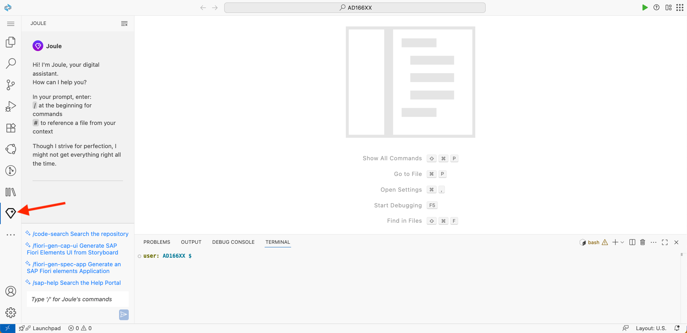
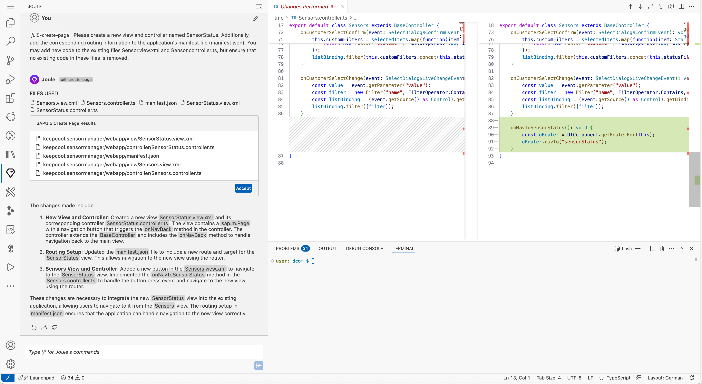
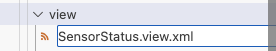
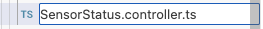

# Exercise 7 - Add a Second View with Navigation with Help of Joule

## Background & Context
> 📖 **What you'll learn**: Your customer does not only want to have a broad overview of all their icehouses. In case of an error they'd like to inspect a sensor for recent temperature data. You'll add a second view to display more available data.

## Learning Objectives
> 🎯 **After completing these steps** you will have:
> - Created a second view for detailed sensor information
> - Implemented navigation between views
> - Set up routing for the new view
> - Added navigation functionality to sensor cards

## Exercise Steps

### Create a new view using 'Joule'

📋 **Next Step**: Create a new view either manually or using Joule AI assistance.

> 💡 **Alternative Option**: Below you will find instructions on how to create a view manually. As an alternative, you can try creating your view using Joule.

1. **Access Joule AI assistant**
   
   Click on the 'Joule' symbol in the left side pane. You should see the 'Joule' chat panel.
   <br><br><br><br>

2. **Use the UI5 creation command**
   
   Start your prompt with the command `/ui5-create-page` and add additional input such as the name of the view and any specific information.

   A good example for a prompt in this tutorial step would be:

   ```text
   Please create a new view and controller named SensorStatus. Additionally, add the corresponding routing information to the application's manifest file (manifest.json). You may add new code to the existing files Sensor.view.xml and Sensor.controller.ts, but ensure that no existing code in these files is removed.
   ```

    Feel free to experiment with the prompt and Joule. It may take a moment to receive a response, but you should see a similar result as shown in the screenshot below.

3. Now you can decide whether you want to apply the suggested change by pressing the **'Accept'** button or whether you want to refine or ignore it.
<br><br><br><br>

4. Within the tutorial, it's necessary to go through the steps below and check the created code. This is essential because the result of the prompt can vary, and to ensure that the further tutorial steps are still valid, it's necessary to sync your created code with the tutorial.

> ⚠️ **Note**
> 
> There are currently three UI5-related Joule commands. You can also use `/ui5` to ask Joule to explain specific UI5 coding, or use `/ui5-typescript` to get help migrating your UI5 JavaScript project to TypeScript.

### Exercise 7.1 - Create SensorStatus.view.xml

📋 **Next Step**: Create the view file for sensor status details.

> 📖 **Context**: Create a new view as follows:

1. **Navigate to the view folder**
   
   Go to folder `keepcool.sensormanager/webapp/view/`.

2. **Create new file**
   
   Right-click on the `view` folder and select `New File`.

3. **Name the view file**
   
   Enter `SensorStatus.view.xml` as file name.
   <br><br><br><br>

4. **Add the page structure**
   
   Add an empty `sap.m.Page` to the newly created view.

    ***keepcool.sensormanager/webapp/view/SensorStatus.view.xml***

    ```xml
    <mvc:View
        displayBlock="true"
        xmlns:mvc="sap.ui.core.mvc"
        xmlns="sap.m">
        <Page
            id="SensorStatusPage"
            title="{i18n>titleSensorStatus}"
            showNavButton="true">
        </Page>
    </mvc:View>
    ```

### Exercise 7.2 - Configure the `manifest.json` file

📋 **Next Step**: Add routing configuration for the new view.

> 📖 **Context**: After creating the new view, you'll next add routing information for it to the `manifest.json` file.

1. **Open the manifest file**
   
   Open `keepcool.sensormanager/webapp/manifest.json`.

2. Go to section `sap.ui5` / `routing` / `routes`.

3. Add a new entry to the `routes` configuration. Note that the new route contains a patch segment in brackets: `{index}`. This will later pass the currently selected sensor as a parameter in the browser hash.

    ***keepcool.sensormanager/webapp/manifest.json***

    ```json
                    {
                        "name": "sensorStatus",
                        "pattern": "sensor/{index}",
                        "target": ["sensorStatus"]
                    }
    ```

4. Go to section `sap.ui5` / `routing` / `targets`.

5. Add a new entry to the `targets` configuration. Here, you need to pass `SensorStatus` as the `viewName`.

    ***keepcool.sensormanager/webapp/manifest.json***

    ```json
                    "sensorStatus": {
                        "viewId": "sensorStatus",
                        "viewName": "SensorStatus",
                        "viewLevel": 2
                    }
    ```

6. *OPTIONAL*: Let's see if the newly created view can be opened. Switch to the browser tab with the opened application preview. Add `#/sensor/0` at the end of the URL in the browser's location bar and open that URL (The UI5 application is refreshed, and the newly created page is displayed.
<br><br><br><br>

## Exercise 7.3 - Implement the Navigation to the New View

Great! You can access the newly created view. Next, you need to implement logic to navigate from your first view to the newly created one.

1. Open `keepcool.sensormanager/webapp/controller/Sensors.controller.ts`.

2. Create the function `navToSensorStatus`. Here, you get the index of the currently selected sensor and navigate to the new view by passing the index.

    ***keepcool.sensormanager/webapp/controller/Sensors.controller.ts***

    ```ts
        navToSensorStatus(event: ListItemBase$PressEvent): void {
            const sensorIndex = (event.getSource() as Control).getBindingContext("sensorModel")?.getProperty("index") as number;
            this.navTo("sensorStatus", {index: sensorIndex});
        }
    ```

The `BaseController`, that was generated by Easy-UI5, offers a `navTo` function, simplifying the navigation logic that needs to be implemented from your side.

## Exercise 7.4 - Assign the Navigation Logic to the Sensor Items

> 📖 **Background & Context**
> 
> After implementing the navigation logic, you need to assign it to a control so users can trigger the navigation by interacting with sensor cards in the UI.

📋 **Next Step**: Wire navigation event to sensor list items.

1. Open `keepcool.sensormanager/webapp/view/Sensors.view.xml`.

2. Add the `press` event to the `sap.m.CustomListItem` control and assign the newly created function.

    ***keepcool.sensormanager/webapp/view/Sensors.view.xml***

    ```xml
                                <CustomListItem
                                    type="Active"
                                    press=".navToSensorStatus">
    ```

✅ **Test Your Navigation**: 

3. Let's see if the navigation logic works. Switch to the browser tab with the opened application preview. In the URL, remove any content after `index.html`. Reload the page. Click any sensor. The navigation takes place, and you see the newly created view.
<br><br><br><br>

## Exercise 7.5 - Create SensorStatus.controller.ts

> 📖 **Background & Context**
> 
> To implement navigation back to the Sensors view and handle the detailed sensor view logic, you need a dedicated controller for the SensorStatus view.

📋 **Next Step**: Create a new controller for the SensorStatus view.


1. Go to folder `keepcool.sensormanager/webapp/controller/`.

2. Right-click on the `controller` folder and select `New File`.

3. Enter `SensorStatus.controller.ts` as file name.
<br><br><br><br>

4. Copy and paste the controller definition given below into the newly created `SensorStatus.controller.ts`.

    ***keepcool.sensormanager/webapp/controller/SensorStatus.controller.ts***

    ```ts
    import BaseController from "./BaseController";

    /**
     * @namespace keepcool.sensormanager.controller
     */
    export default class SensorStatus extends BaseController {

        public onInit(): void {

        }
    }
    ```

5. Open `keepcool.sensormanager/webapp/view/SensorStatus.view.xml`.

6. Using the `controllerName` attribute, assign the newly created controller to the view.

    ```xml
    <mvc:View
        controllerName="keepcool.sensormanager.controller.SensorStatus"
        displayBlock="true"
        xmlns:mvc="sap.ui.core.mvc"
        xmlns="sap.m">
    ```

## Exercise 7.6 - Implement the Back-Navigation to Sensors.view.xml

> 📖 **Background & Context**
> 
> To complete the navigation flow, you need to implement back-navigation functionality that allows users to return from the detailed sensor view to the main sensor list.

📋 **Next Step**: Wire up the back navigation button.

Next you need to implement the navigation logic. You can use another functionality, that is provided by the `BaseController`, the convenience event handler `onNavBack`.

1. Open `keepcool.sensormanager/webapp/view/SensorStatus.view.xml`.

2. Add the `navButtonPress` event to the `sap.m.Page` control and assign the newly created `onNavBack` function to it.

    ***keepcool.sensormanager/webapp/view/SensorStatus.view.xml***

    ```xml
        <Page
            id="SensorStatusPage"
            title="{i18n>titleSensorStatus}"
            showNavButton="true"
            navButtonPress="onNavBack">
        </Page>
    ```

✅ **Test Your Complete Navigation Flow**: 

3. Let's see if the navigation logic works. Switch to the browser tab with the opened application preview. In the URL, remove any content after `index.html`. Reload the page.
<br><br><br><br>

4. Click any sensor. The navigation takes place, and you see the newly created view.
<br><br><br><br>

5. Click the "<" button to navigate back to the sensor list. Thanks to how the Router works, you can also use the "Back" button of the browser or your mobile device instead.
<br><br><br><br>

## Summary

> ✅ **Congratulations!** You completed [Exercise 7 - Second View with Navigation](#exercise-7---second-view-with-navigation)!
> 
> **What you accomplished**:
> - ✓ Created a second view for detailed sensor information
> - ✓ Implemented navigation between views using routing
> - ✓ Set up proper routing configuration
> - ✓ Added navigation functionality to sensor cards
> - ✓ Learned to use Joule AI for UI5 development

---

**📚 Next Steps**: Continue to [Exercise 8 - Card with NumericHeader](../ex8/README.md).

## Further Information

> 📚 **Additional Resources**:
> * [Routing in UI5](https://ui5.sap.com/#/topic/902313063d6f45aeaa3388cc4c13c34e)
